# EconomyCraft

_A Flutter Webapp designed to provide an amazon like shopping experience for company shares and products. All in an effort to create an immersive economy for a modded minecraft server._

---

## Features Showcase

### 1. Getting Started
#### Login & Homepage  
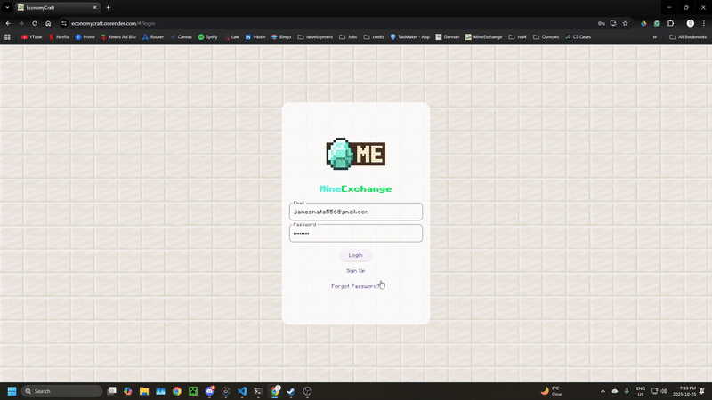  
> *Current 2.0 Homepage Layout*

---

### 2. Exploring the Market
#### Browse the Market  
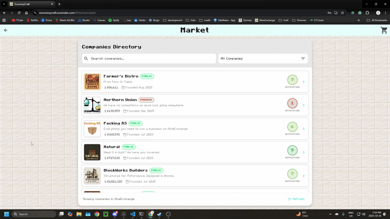  
> *Explore the market to find new products to purchase*

#### Manage Cart  
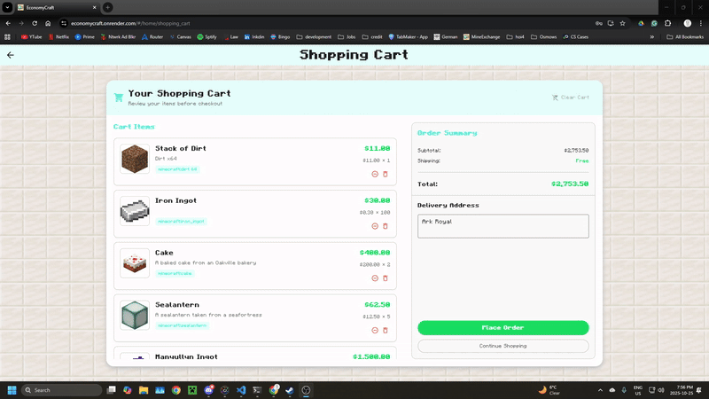  
> *Use the cart screen to finalize your orders*

#### Manage Your Orders  
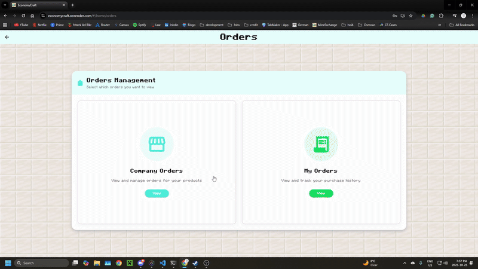  
> *Track your orders' progress and mark them complete*

---

### 3. Creating & Managing Companies
#### Form a New Company  
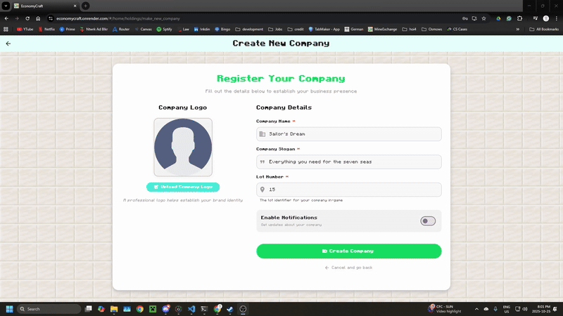  
> *Form a new company to sell products to other players*

#### Manage Your Company  
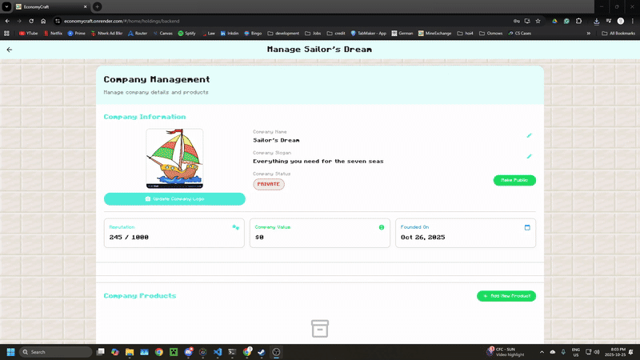  
> *Manage your company to add and remove products as well as adjust your company's position on the market*

#### Manage Your Company's Orders  
  
> *Manage your company's orders to update your users on the progress of their purchase*

---

### 4. Trading and Orders

#### Track Public Companies  
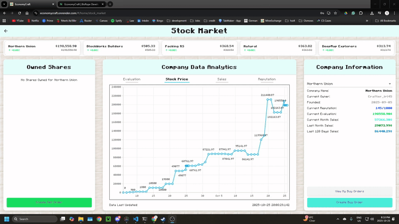  
> *Track the success of public companies to adjust your trading strategies*

#### Make Buy Orders  
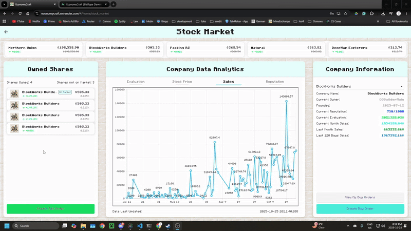  
> *Create buy orders to acquire more shares from a company*

#### Make Sell Orders  
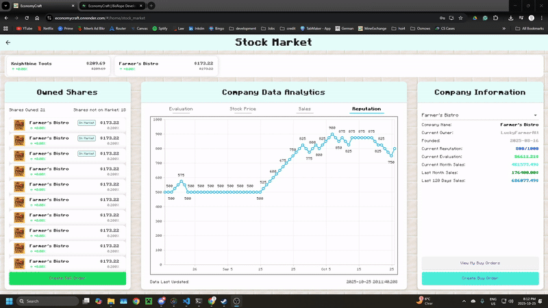  
> *Create sell orders to dump shares no longer valuable to you or to cash out*

---

### 5. Tracking & Analytics
#### Track Investments  
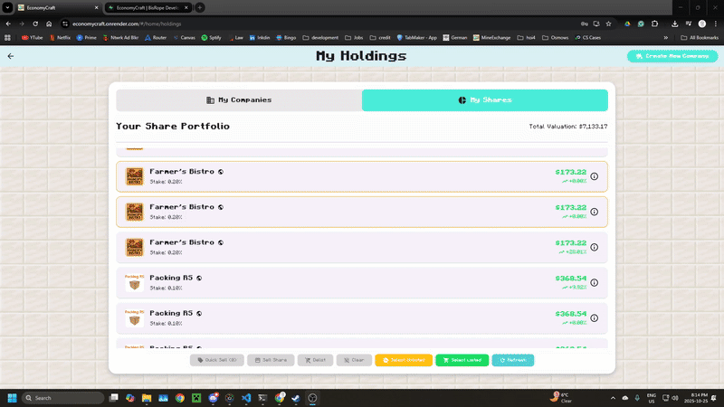  
> *Track your holdings to see how well each share is doing*

#### Track Other Players  
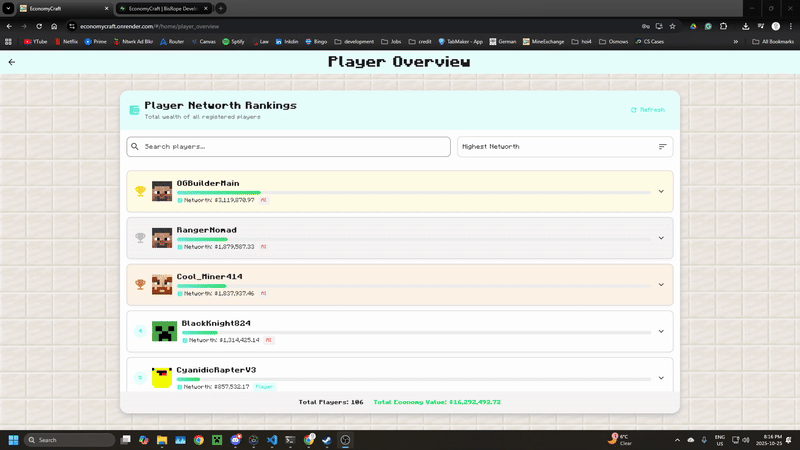  
> *Track other players' networths to see where you are on the world stage*

---

### 6. Money & Server Info
#### Transfer Money  
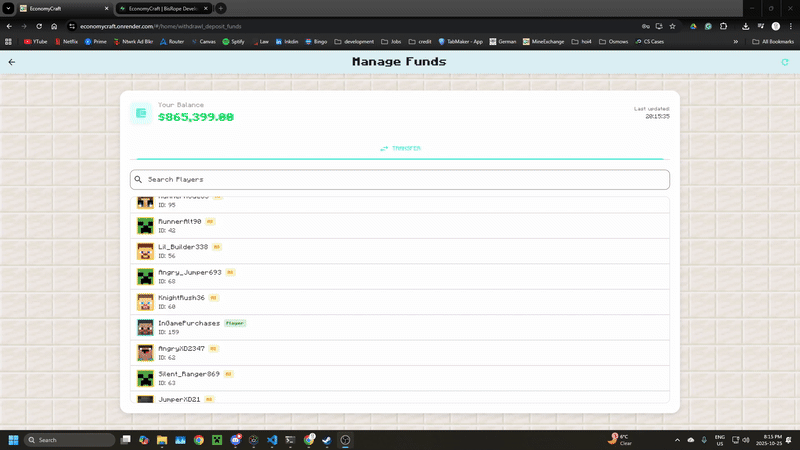  
> *Send money to other players whenever you want*

#### See Server Info  
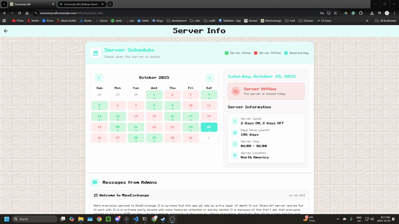  
> *Check server info to find out times for when the server is on as well as view messages released by the admins*

---

## ⚙️ Hosted here:
> *https://mineexchange.vercel.app/#/*

---

