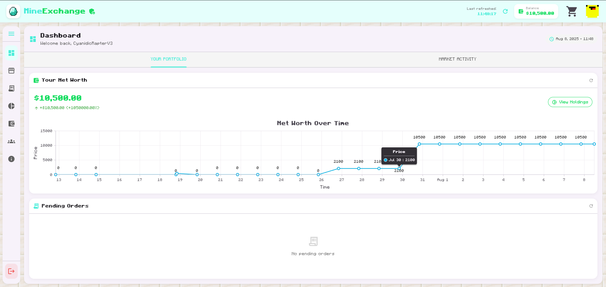
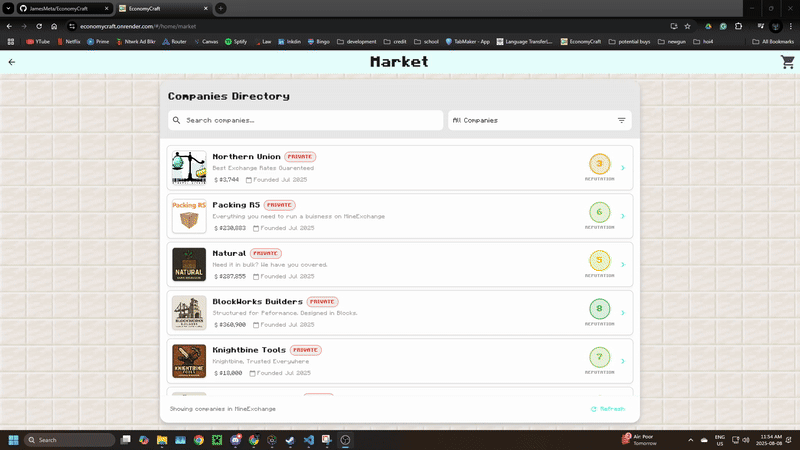
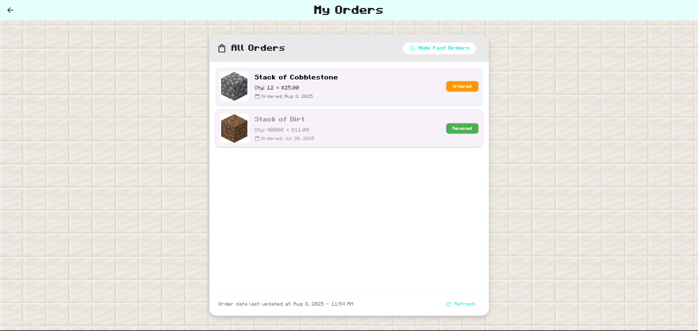
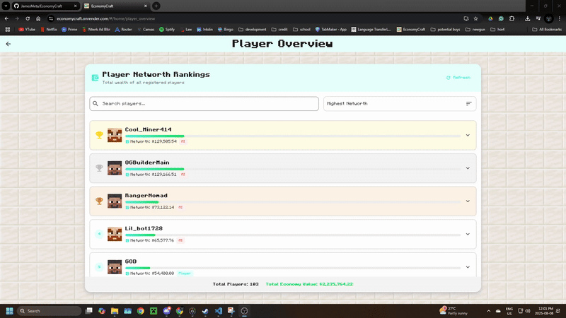

# EconomyCraft

A Flutter Webapp designed to provide an amazon like shopping experience for company shares and products. All in an effort to create an immersive economy for any modded minecraft server. 

[EconomyCraft](https://economycraft.onrender.com/#/home)

### Purchasing Products

### AI and Human Users

### Technologies Used

